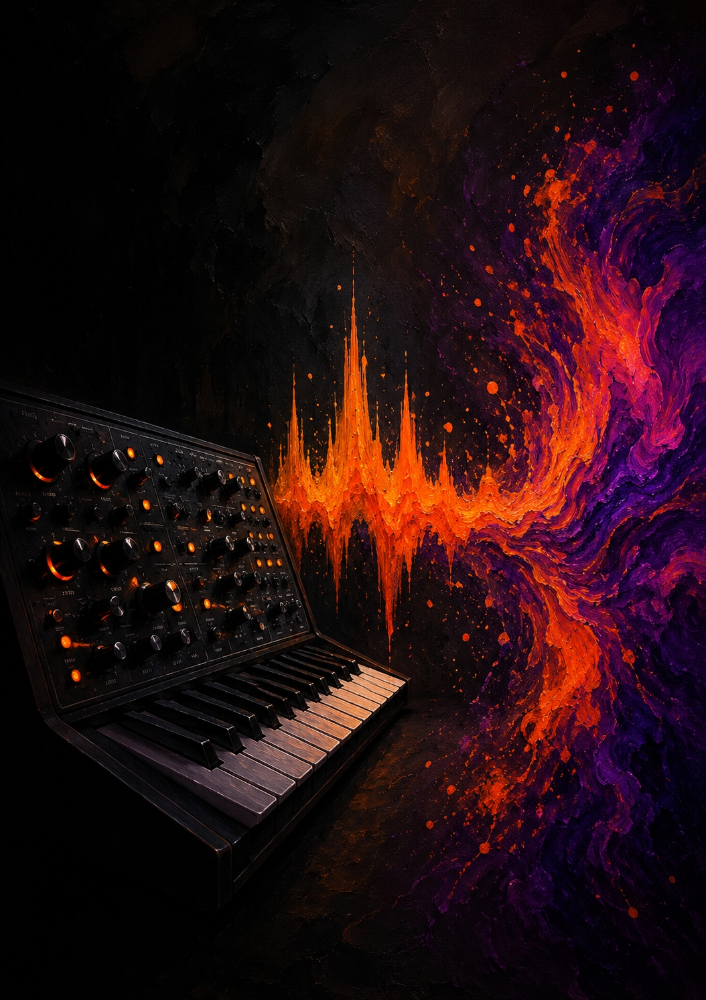

# Voice Sonic Pi Engine

A declarative, strict-schema step-sequencer, granular synthesizer, and sampling engine built for Sonic Pi. 

This engine separates musical *data* (the playbooks) from the *synthesis and timing logic* (the engine). It enforces a rigid 16-step, 4/4 time signature grid, allowing the composer to focus entirely on crafting arrays of notes, chords, and parameters without worrying about thread management, timing drift, or concurrency bugs.

## The Playbook Builder (AI Integration)

Creating playbooks by hand can be tedious. To make the process instant, we have created the **Playbook Builder**. 

By loading the `playbook_builder_prompt.md` into any modern AI chat agent (like ChatGPT, Claude, etc.), you instantly convert the AI into a "Playbook Builder". The AI will know the engine's strict schema and will translate any musical subject into a functional, engine-ready playbook.

**How to use it:**
1.  Copy the contents of `playbook_builder_prompt.md`.
2.  Paste it into a new AI chat as the first message (or system prompt).
3.  Simply type: `gimme playbook for [subject]` (e.g., `gimme playbook for 90s UK Street Soul`).

The AI will analyze the musical DNA of the subject and output a single Ruby code block containing a standalone blueprint, ready to be run by the engine. You can also just say `gimme next` to get a new random playbook.

## Playbook Library

A library of pre-built playbooks has already been created using the Playbook Builder. These cover a massive range of genres, sub-genres, and specific hit songs. You can find them in the `playbooks/` directory. 

To use one, simply open the `.sonicpi` file in Sonic Pi and hit **Run**.

## Core Philosophy

The engine's strict schema provides separation of concerns. The composer focuses solely on writing notes and data; the engine handles execution and synthesis. This confinement is the case which works: without changing the API, the composer can create most sounds. To maintain this separation, there is `engine_plain.sonicpi` (the known, unoptimized version referenced by the AI prompt) and `engine.sonicpi` (the optimized version used for execution). Separation of concerns happens because the engine does its work and the composer focuses on data.

## The Schema

The engine expects a specific data structure: a **Playbook** containing **Scenes**, which reference **Scores**.

### 1. Scores (16-Step Rings)
A score is a ring of exactly 16 elements. Elements can be notes, chords (arrays of notes), `nil` (rests), or Hashes (for dynamic parameters).

```ruby
# Simple 16-step bassline
s_bass = gen_score("x...x...x...x...", [:c2, :c2, :eb2, :g2])

# 16-step sequence using Parameter Hashes for dynamics
# (The length of the array matches the number of 'x's in the pattern string)
s_kick = gen_score("x...x...x...x...", [:c4, {note: :c4, amp: 0.7}, :c4, :c4])

# Chords (Arrays) inside the grid
s_chords = gen_score("x.......x.......", [[:c3, :eb4, :g4, :bb4], [:f3, :ab4, :c5, :eb5]])
```

### 2. Playbook (Timeline of Scenes)
The playbook is a ring of "Scenes". Each Scene is an array of tasks that play concurrently.
Format: `[ [:instrument, score, bars_to_play], ... ]`

```ruby
playbook = (ring
  # Scene 1: Play kick for 2 bars
  [ [:play_kick, s_kick, 2] ],
  
  # Scene 2: Play kick (4 bars) and sub bass (2 bars) concurrently
  [ [:play_kick, s_kick, 4], 
    [:play_sub,  s_bass, 2] ]
)

start_engine(playbook)
```

## Engine API Reference

### Instruments
The engine comes with 10 built-in instrument functions. All pitched instruments map relative to `:c4` (MIDI 60).

**Bass & Sub:**
*   `:play_sub` - Distorted subtractive bass (`:dsaw`).

**Synths & Leads:**
*   `:play_lead` - Wavetable lead (`:prophet`) routed through a tape echo.
*   `:play_chords` - Warm sustained pad (`:blade`) designed to play arrays of notes (chords).
*   `:play_fm` - FM Bell/Synth (`:fm`).
*   `:play_pluck` - Physical modeling (`:pluck`).
*   `:play_pad` - Dark ambient drone (`:dark_therm`).

**Granular:**
*   `:play_grain` - **True Granular Synthesizer.** (See Granular Parameters below).

**Drums & Percussion:**
*   `:play_kick` - Pitched kick drum sampler.
*   `:play_snare` - Snare sampler routed through a massive hall reverb.
*   `:play_hats` - Micro-timed hi-hats with ghost notes.

### The Granular Synthesizer (`:play_grain`)
The `:play_grain` instrument is a fully featured granular engine. You can control it by passing these optional keys in your Parameter Hash:

*   `note:` - The pitch to shift the grain to (relative to `:c4`).
*   `buffer:` - The Sonic Pi sample to granulate (Default: `:ambi_choir`).
*   `pos:` - The buffer playback position / scrub head (`0.0` to `1.0`).
*   `size:` - Grain duration in seconds (Default: `0.05` / 50ms). Short sizes sound like static; long sizes sound like a pad.
*   `density:` - Number of grains fired per 16th step (Default: `4`).

**Example Granular Step:**
```ruby
{note: :c4, buffer: :misc_lori, pos: 0.5, density: 8, size: 0.08}
```

## Execution

To use the engine, load the optimized version into memory using `eval_file "path/to/engine.sonicpi"` in your composition script, define your scores using `gen_score`, define your playbook, and call `start_engine`.

```ruby
use_bpm 120
eval_file "path/to/engine.sonicpi"

# Define scores...

# Define playbook...

start_engine(playbook)
```
